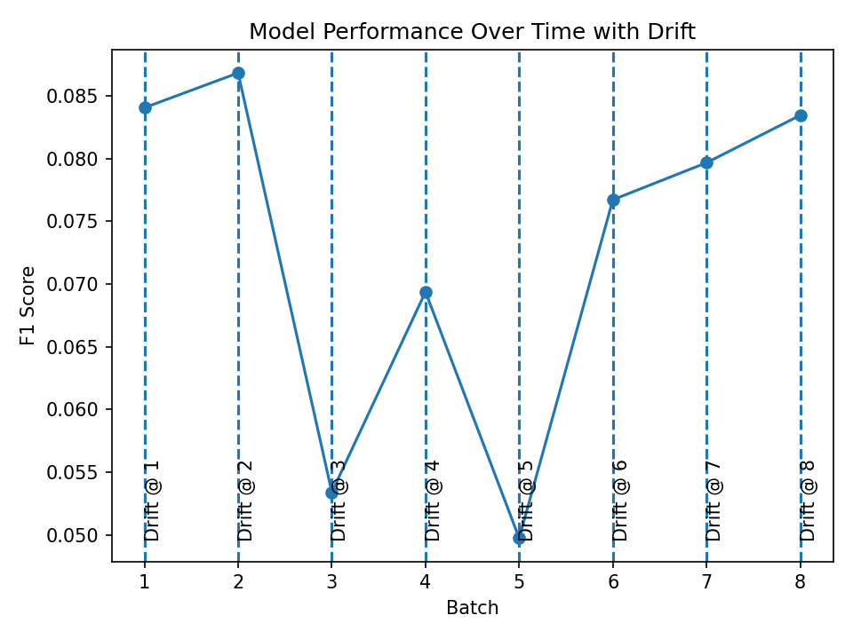
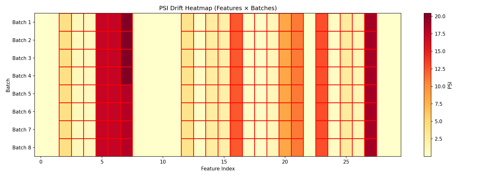

# Adaptive Fraud Detection with Drift Handling

## Overview
This project implements a fraud detection system that adapts to changing data distributions (concept drift) in transaction streams.

## Features
- Simulated **prior drift** (fraud rate changes)
- Simulated **covariate drift** via PCA feature shifts (V4, V11, V7)
- Drift detection using **Population Stability Index (PSI)** across all features
- **Sliding window retraining** for adaptive learning
- Performance tracking over time (F1 score)
- PSI heatmap visualization

## Setup

### 1. Install Dependencies
```bash
pip install -r requirements.txt
```

### 2. Download Dataset
```bash
python download_data.py
```
This downloads the Kaggle creditcard fraud dataset and places it in `data/creditcard.csv`.

### 3. Run the System
```bash
python main.py
```

## Key Insight
Models degrade when fraud patterns evolve. This system detects distribution shifts and adapts automatically.

## Tech Stack
Python, NumPy, Pandas, Scikit-learn, Matplotlib, Kagglehub

## Results

### Model Performance Over Time


### Drift Detection (PSI Heatmap)


## Limitation
Drift is detected against a fixed reference distribution. A production system would use a rolling reference window.
